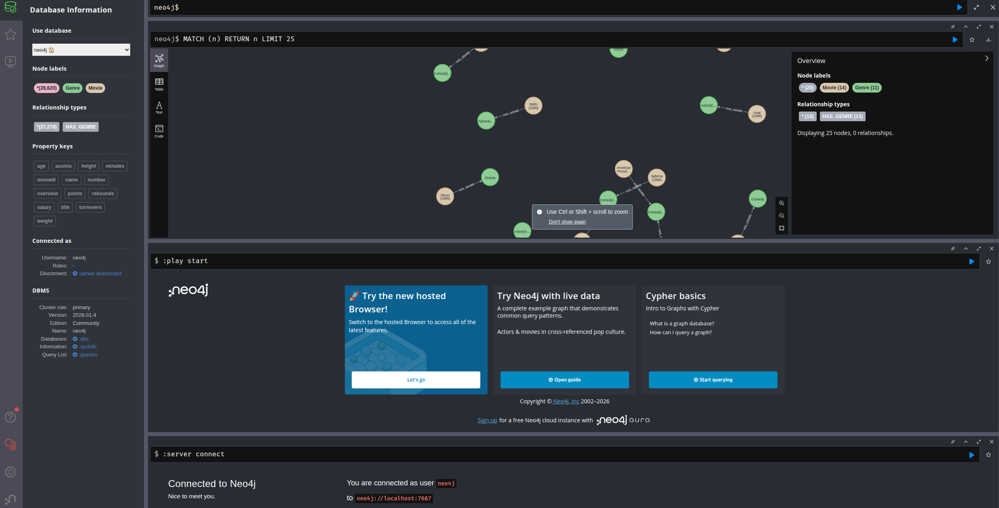
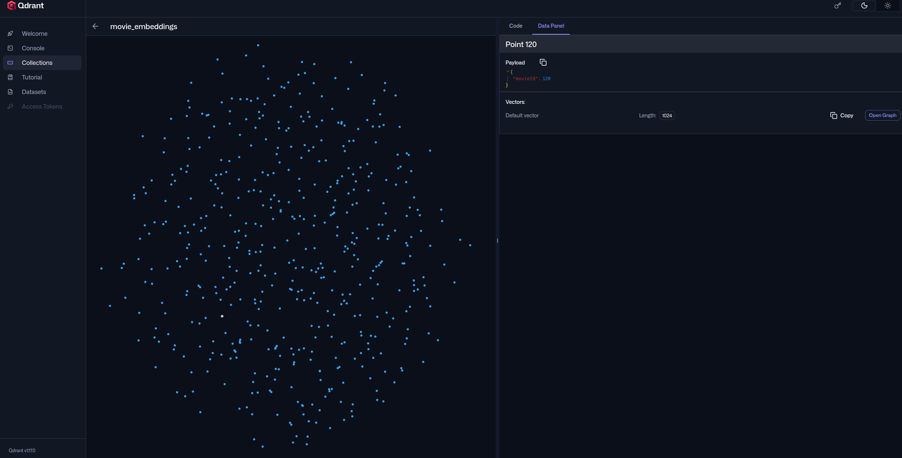
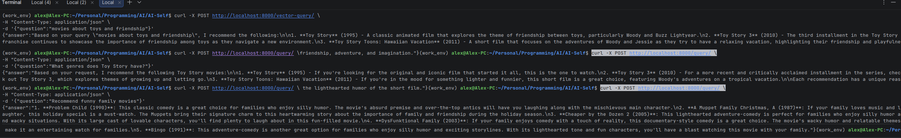

# GraphRAG-MovieRecommendation

## Description

This is just a PoC project to test a simple GraphRAG architecture and learn more about knowledge graph databases.
particulary neo4j. What this is is a FastAPI backend for a movie recommendation system. It exposes 3 endpoints:
- `/ingest/entry` -> ingest a movie payload to qdrant and neo4j
- `/query` -> provides 3 different query types depending on text input decided by LLM:
  - graph approach (where we use neo4j for metadata queries))
  - vector approach (use a hybrid approach where we use qdrant for description similarity and neo4j for metadata queries to build context)
  - recommendation approach (use similar hybrid approach but with a prompt dedicated to recommendation)
- `/vector-query` -> test endpoint for comparison with normal RAG approach

The dataset used is https://www.kaggle.com/datasets/grouplens/movielens-20m-dataset which already provides relations between movies
and their genres, thus making a good candidate to a simple example of neo4j knowledge graph database.

I had to make an additional script to extract the metadata and another to process it and add metadata to the neo4j database + load descriptions from TMDB, use llama
embeddings and then add them to the qdrant database.
## Teck Stack

1. FastAPI - for backend
2. Neo4j - for local graph database
3. Qdrant - for local vector database
4. Langchain - for LLM inference chains
5. Docker - for containerization
6. Ollama - for local model
## File Structure
### api
This is where the FastAPI app is located with all endpoints and routes. Besides the endpoints mentioned above, 
there are also a healtcheck endpoint and a `/admin/ingest` to initially populate all movielens dataset into our databases.
### config
This is settings used by the app. Check the file and change anything if needed.
### data
This is where the raw and processed data is located. I kept it just as proof of work and for the user to not go through
everything again.
### db
These are the communication layers with neo4j and qdrant databases.
### docker
Just the docker-compose file to run the app. Please, make sure you check every enviroment variable in the file.
### ingestion
This is where the embedding pipeline for creating the qdrant collection and embedding and uploading resides as well as the graph
builder for metadata and upload to neo4j.
### rag
This is probably the most important module of the project. This is where the prompts, retrievers and langchain chains are located as well as
query router logic for `/query` endpoint and context builder for hybrid approachess.
### scripts
The scripts mentioned in the description.
## Installation
1. Make sure you have a working python environment, version at least `3.10` and pip as module manager installed (this is just for evaluation part).
2. Make sure you have Docker Desktop installed if you're on Win (or Docker Engine with Docker Daemon if you're on Linux)
3. Run ```cd graph-rag-movielens``` and ```pip install -r requirements.txt```
4. Run ```cd docker```
5. Verify the `docker-compose.yaml` file to contain all env variables (already should, but for example, if you want to use another LLM model, check `env.example` as a template on what to modify).
6. Run `docker-compose up -d` in a terminal in root folder. Wait for all containers to raise up.
7. Inside `ollama` container run ```ollama pull llama3:latest```
8. Run ```curl -X POST http://localhost:8000/admin/ingest``` to populate the databases
9. Visit the webui interface for each storage on:
  - neo4j: http://localhost:7474/browser/
  - qdrant: http://localhost:6333/dashboard/
10. Start using the API! (the query endpoints are POST and accept a JSON body with `question` field) and the ingest looks
```bash
curl -X POST http://localhost:8000/ingest/entry \
-H "Content-Type: application/json" \
-d '{
  "movieId": 88888,
  "title": "AI Pirates",
  "genres": ["Adventure","Sci-Fi"],
  "overview": "A pirate AI conquers the galaxy",
  "embedding_text": "A science fiction pirate adventure with artificial intelligence"
}'
```
## Visuals & Requests
#### Neo4j interface

#### Qdrant interface

#### Example requests
  
## Additional Note
It was a fun project, but there's definetely room for improvement. There are iterative approaches for obtaining higher quality graphs, or inference results for example.
There are some research papers that I would like to read and implement in the future with different architectures, but this is just a PoC to get more acustomed with neo4j and
graph RAG approaches.
